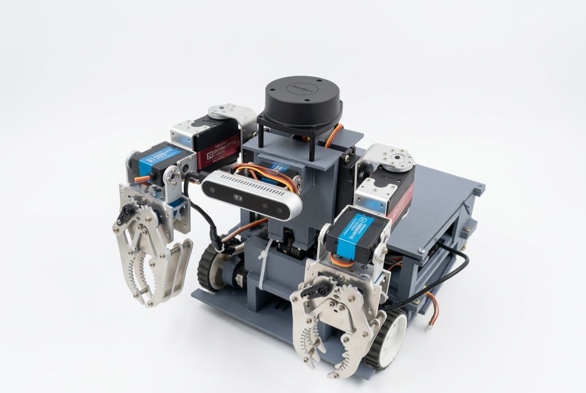
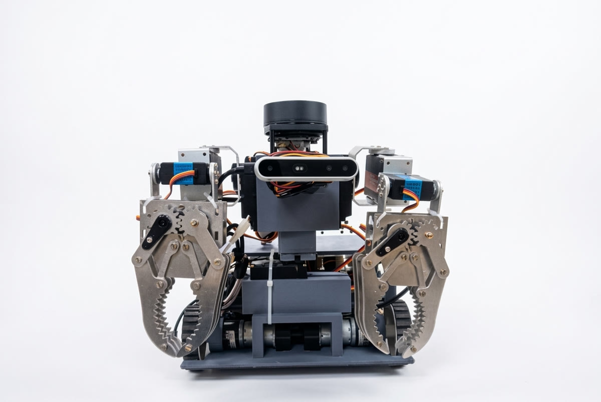
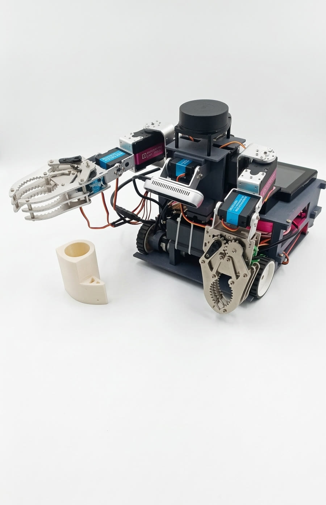
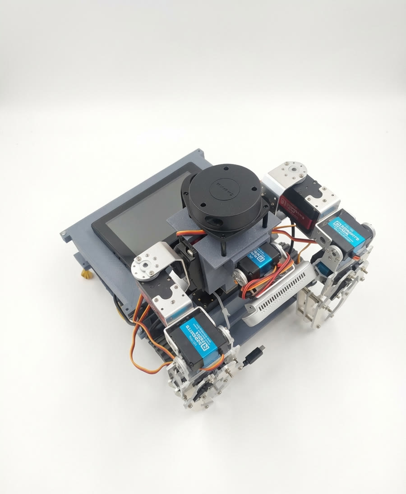
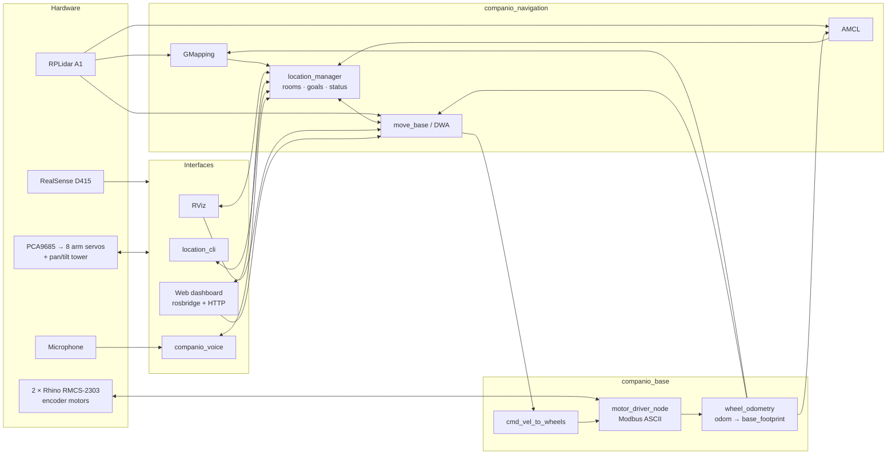

<div align="center">

# Companio

### Autonomous healthcare assistance robot · Robofest 5.0



**SLAM mapping · room-to-room autonomous navigation · dual-arm manipulation · voice commands · web telemetry dashboard**

Built on ROS Noetic, running in Docker on a Raspberry Pi 5.

</div>

---

## Overview

Companio is a compact (≈30 × 30 × 30 cm) mobile manipulator designed to assist inside hospital environments: it maps a ward, learns the location of rooms, autonomously delivers items between them while avoiding people and obstacles, and uses two servo arms to pick up and hand over objects. It was developed by Team Roboraptos (BVM Engineering College) for **Robofest 5.0**, organised by the Gujarat Council on Science and Technology.

### What it does

| Capability | How |
|---|---|
| **2D SLAM mapping** | RPLidar A1 + GMapping with wheel-encoder odometry |
| **Named rooms** | Save any number of rooms *while mapping* (RViz, dashboard, CLI or voice); stored next to the map and reloaded on every start |
| **Autonomous navigation** | AMCL localisation + move_base (DWA local planner) with dynamic obstacle avoidance and re-planning |
| **Full control from RViz** | 2D Pose Estimate, 2D Nav Goal, *Publish Point → save room*, drag/rotate room markers, right-click a room → *Go here / Delete / Localize* |
| **Web dashboard** | Live map, robot pose, laser, plan, rooms, navigation status, manual drive, arms, camera — any phone or laptop on the network |
| **Dual robotic arms** | 2 × 4-DOF servo arms with grippers (PCA9685), joint limits, collision rules, analytic + numerical inverse kinematics, vision-triggered pick sequences |
| **Voice control** | Spoken teleoperation and *"go to Ward A"* navigation commands |
| **Line & zone following** | IR-sensor and camera-based line following with junction routing (QR codes), colour zone detection (safe / infection) |

<div align="center">
 &nbsp;  &nbsp; 
</div>

---

## System architecture



Everything runs inside one Docker container (`companio/ros-noetic`) on the Raspberry Pi 5; the workspace is bind-mounted so code edits on the host are immediately visible inside.

---

## Hardware

| Component | Part | Notes |
|---|---|---|
| Compute | Raspberry Pi 5 (8 GB) · optional Hailo-8L AI HAT | 64-bit Raspberry Pi OS, Docker |
| Drive | 2 × Rhino RMCS-2303 DC servo motors with encoders | Modbus ASCII over CP210x USB-UART (slave 2 = left, 5 = right) |
| LiDAR | Slamtec RPLidar A1 | 360°, 12 m, mounted on the sensor tower |
| Camera | Intel RealSense D415 | pan/tilt tower, colour stream for line/QR/zone detection |
| Arms | 2 × 4-DOF servo arms (shoulder, arm, elbow, gripper) | PCA9685 16-ch PWM driver over I2C |
| Line sensors | 5-channel IR array | GPIO via libgpiod |
| HMI | 7" touchscreen, microphone | dashboard + voice |

Persistent device names are provided by [config/udev/99-companio.rules](config/udev/99-companio.rules): `/dev/rplidar`, `/dev/motor_left`, `/dev/motor_right`.

---

## Repository layout

```
companio_ws/                     catkin workspace (mounted at /root/companio_ws in the container)
├── docker/Dockerfile            ROS Noetic + navigation + RealSense + Hailo + rosbridge image (arm64)
├── scripts/                     host-side helpers (setup, teleop, mapping, navigation, arms, ...)
├── config/udev/                 USB device rules
├── docs/                        guides (setup, hardware, mapping & navigation, dashboard, arms, ...)
└── src/
    ├── companio_bringup         top-level launch files: base, teleop, mapping, navigation, camera, full_system
    ├── companio_base            RMCS-2303 motor driver, cmd_vel mixing, wheel odometry
    ├── companio_description     URDF (xacro), RViz views, maps + room files
    ├── companio_navigation      GMapping / AMCL / move_base configs, location_manager, location_cli
    ├── companio_msgs            SaveLocation / LocationName / RenameLocation services
    ├── companio_web             dashboard (www/) + HTTP server + rosbridge launch
    ├── companio_arms            arm & tower controllers, IK, pick sequences, gripper vision
    ├── companio_voice           voice teleop and voice navigator
    ├── companio_line_follower   IR and camera line following, QR destination routing
    └── companio_zone_detection  blue/red floor zone detection
```

---

## Quick start (Raspberry Pi 5)

```bash
git clone https://github.com/Karansinh22/ROBOFEST5.0_Companio_Healthcare.git companio_ws
cd companio_ws

./scripts/install_docker.sh           # once: Docker Engine (log out/in afterwards)
sudo ./scripts/install_udev_rules.sh  # once: /dev/rplidar, /dev/motor_left, /dev/motor_right
./scripts/setup_container.sh          # builds the image, starts the container, runs catkin_make
```

Each `start_*.sh` script opens the corresponding `roslaunch` inside the container. Use `./scripts/enter_container.sh` for a shell, or `./scripts/run.sh <ros command>` for one-off commands. Full details: [docs/SETUP.md](docs/SETUP.md).

### 1. Drive

```bash
./scripts/start_teleop.sh             # keyboard: i , j l k
```

### 2. Map a ward and save its rooms

```bash
./scripts/start_mapping.sh map_name:=hospital_map
```

Drive slowly around the area. Whenever the robot stands in a room you care about, save it by any of:

* **RViz** – *Publish Point* tool, click the spot on the map (rooms appear as blue discs; drag/rotate them to adjust)
* **Dashboard** – `http://<robot-ip>:8000` → *Rooms → Save current pose* (or *Save Room* mode on the map)
* **Terminal** – `./scripts/locations.sh save "Ward A"`

When the map is complete:

```bash
./scripts/save_map.sh hospital_map    # writes hospital_map.pgm/.yaml; rooms are in hospital_map.locations.yaml
```

### 3. Navigate autonomously

```bash
./scripts/start_navigation.sh map_name:=hospital_map
```

Tell AMCL where the robot is (RViz *2D Pose Estimate*, dashboard *Set Pose*, or `./scripts/locations.sh localize Home`), then send it anywhere:

| From | How |
|---|---|
| RViz | *2D Nav Goal*, or right-click a room marker → **Go here** |
| Dashboard | click a room's **Go** button, or click anywhere on the map |
| Terminal | `./scripts/locations.sh go "Ward A"` |
| Voice | `./scripts/run.sh roslaunch companio_voice voice.launch` → *"go to Ward A"* |

Navigation status (`navigating → arrived / failed / cancelled`, distance left) is published on `/navigation/status` and shown on the dashboard.

### 4. Arms, camera, everything

```bash
./scripts/start_arms.sh                                      # controllers
./scripts/run.sh rosrun companio_arms arm_teleop.py          # keyboard arm control
./scripts/run.sh roslaunch companio_bringup camera.launch    # RealSense colour stream
./scripts/run.sh roslaunch companio_bringup full_system.launch   # navigation + arms + camera
```

---

## Web dashboard

<p>Served by the robot at <code>http://&lt;robot-ip&gt;:8000</code> (rosbridge on port 9090). Works on the on-board touchscreen, phones and laptops.</p>

* Live occupancy grid with robot pose, laser scan, global plan and room markers; pan/zoom
* Map modes: **Navigate** (click, drag for heading), **Set Pose** (AMCL initial pose), **Save Room**
* Rooms panel: save the current pose under a name, go / rename / delete, *Go Home*
* Navigation status with distance remaining, **Cancel** and **E-STOP**
* Manual drive pad (hold or W/A/S/D), speed sliders
* Telemetry: pose, velocity, nearest obstacle, laser rate, move_base state
* Arm & tower sliders, live camera stream

See [docs/WEB_DASHBOARD.md](docs/WEB_DASHBOARD.md).

---

## Key ROS interfaces

| Interface | Type | Purpose |
|---|---|---|
| `/cmd_vel` | geometry_msgs/Twist | velocity command (teleop, move_base, voice, dashboard) |
| `/odom`, TF `odom→base_footprint` | nav_msgs/Odometry | wheel odometry |
| `/scan` | sensor_msgs/LaserScan | RPLidar |
| `/locations/save` `/locations/go_to` `/locations/delete` `/locations/rename` `/locations/localize_at` `/locations/cancel` | companio_msgs services | room management and navigation |
| `/locations/list` | std_msgs/String (JSON, latched) | all rooms of the current map |
| `/locations/markers`, `/locations/update` | MarkerArray / interactive markers | RViz room visualisation and editing |
| `/navigation/status` | std_msgs/String (JSON, latched) | navigation state machine |
| `/robot_pose` | geometry_msgs/PoseStamped | robot pose in the map frame |
| `/left_arm/joint_commands`, `/right_arm/joint_commands`, `/tower/joint_commands` | std_msgs/Float64MultiArray | arm and tower joint targets (degrees) |

---

## Documentation

* [Setup (Pi 5 + Docker)](docs/SETUP.md)
* [Hardware & wiring](docs/HARDWARE.md)
* [Mapping, rooms & navigation](docs/MAPPING_AND_NAVIGATION.md)
* [Web dashboard](docs/WEB_DASHBOARD.md)
* [Arms & manipulation](docs/ARMS.md)
* [Line following & zone detection](docs/LINE_FOLLOWING.md)
* [Voice control](docs/VOICE_CONTROL.md)
* [Troubleshooting](docs/TROUBLESHOOTING.md)

---

## Team

**Team Roboraptos — Birla Vishvakarma Mahavidyalaya Engineering College**
Karansinh Desai · Japan Pancholi · Dev Mathukiya · Parth Shah

Mentor: Dr. Dipakkumar Patel. Presented at Robofest 5.0 (Gujarat Council on Science and Technology, Department of Science & Technology, Government of Gujarat), Gujarat Science City, Ahmedabad, March 2026.

## License

MIT — see [LICENSE](LICENSE). The bundled `roslib.min.js` is © the roslibjs authors (BSD, see `src/companio_web/www/vendor/ROSLIBJS_LICENSE`).
