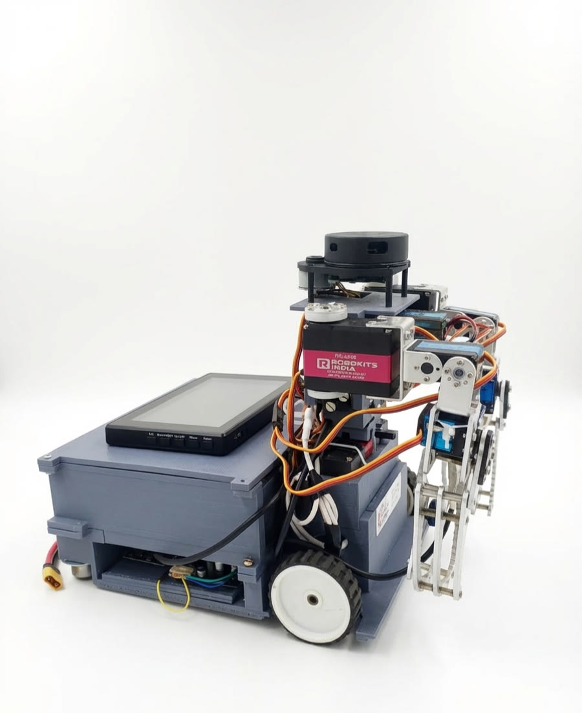

# Hardware



| Subsystem | Part | Interface | Software |
|---|---|---|---|
| Compute | Raspberry Pi 5 | — | Docker + ROS Noetic |
| AI accelerator | Hailo-8L AI HAT (optional) | PCIe (`/dev/hailo0`) | camera line detector falls back to CPU OpenCV |
| Drive motors | 2 × Rhino RMCS-2303 (DC servo + encoder, 100:1) | Modbus ASCII 9600 8N1 over CP210x USB-UART | `companio_base/motor_driver_node.py` |
| LiDAR | RPLidar A1 | USB-UART 115200 | `rplidar_ros` |
| Camera | Intel RealSense D415 | USB 3 | `realsense2_camera` |
| Servo driver | PCA9685 16-channel | I2C bus 1, address 0x40 | `companio_arms` |
| Line sensors | 5 × IR reflectance | GPIO 17, 27, 22, 23, 24 (BCM) via libgpiod | `companio_line_follower` |
| Microphone | USB microphone (`plughw:2,0`) | ALSA | `companio_voice` |
| Display | 7" touchscreen | HDMI/USB | web dashboard |

## Motor controllers (RMCS-2303)

* Left motor: `/dev/motor_left`, Modbus slave **2**. Right motor: `/dev/motor_right`, slave **5**.
* The right motor is mounted mirrored, so `cmd_vel_to_wheels` negates its target; the left encoder counts backwards relative to forward travel, so `wheel_odometry` negates its delta.
* Calibrated constants live in [`src/companio_base/config/base.yaml`](../src/companio_base/config/base.yaml): `velocity_scale 19`, `ticks_meter 607549`, effective `base_width 0.95`. Change them only after re-measuring.
* Register map used by the driver: mode (2), lines per rotation (10), acceleration (12), speed RPM (14), position feedback (20/22).

## Servo channels (PCA9685)

| Channel | Joint | Range (deg) |
|---|---|---|
| 2 / 3 / 4 / 6 | right shoulder / arm / elbow / gripper | 0–150 / 0–135 / 5–160 / 30–175 |
| 7 / 8 / 9 / 12 | left shoulder / arm / elbow / gripper | 0–155 / 10–150 / 15–185 / 30–175 |
| 14 / 15 | tower pan / camera tilt | 0–180 |

Gripper: 175 = closed, 30 = fully open.

## USB device naming

All serial adapters are CP210x and are distinguished by the USB hub port they sit in (`config/udev/99-companio.rules`). After re-plugging the hub, confirm with:

```bash
python3 scripts/identify_motors.py
```

## Frames

`map → odom → base_footprint → base_link → laser` (plus camera and arm links from the URDF in `companio_description/urdf/companio.urdf.xacro`). The lidar is mounted rotated 180° on the tower; this is encoded in the URDF and in the dashboard's laser overlay.
